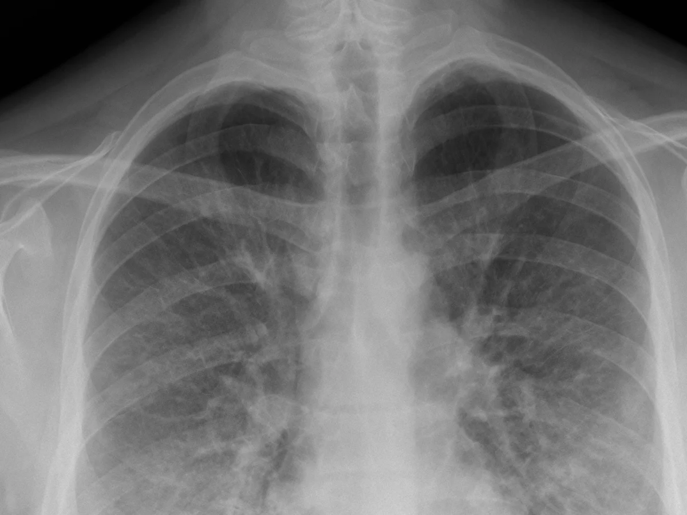
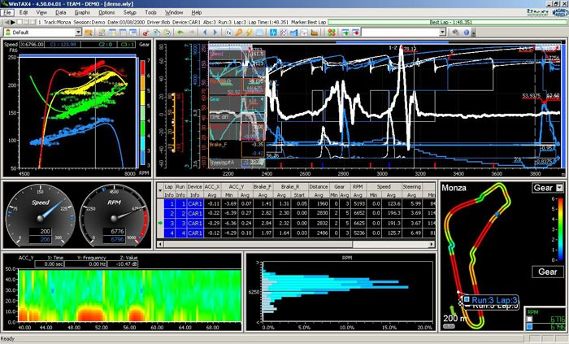
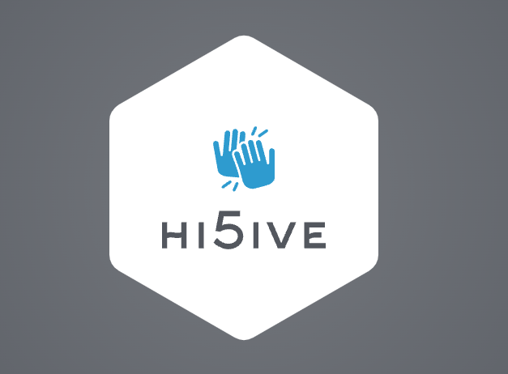

<!-- HERO SECTION -->
# Matthew Martin
**Computer Scientist & Biologist**  
I build projects at the intersection of software, machine learning, and health sciences.  
[View Projects](#projects) | [Download Resume](assets/resumes/AIresume.pdf))

---

<!-- SKILLS SECTION -->
## Skills

### Programming & ML
Python, C#, Java, SQL, TensorFlow, PyTorch, Keras, Scikit-learn, Flask, React

### Tools & Cloud
Git, Docker, AWS

### Data & Research
Pandas, NumPy, Clinical & Lab workflows

---

<!-- PROJECTS SECTION -->
## Projects

<!-- Project 1 -->

  
  <h3>Pneumonia Detection — Deep Learning</h3>
  
Built CNN + VGG16 models with class weighting and augmentation. Achieved 86% accuracy, 0.92 recall.

  
<strong>Tech:</strong> TensorFlow, Keras

  <a href="https://github.com/matthewmartin117/Pnuemonia-Detection-Deep-Learning">GitHub</a>

<!-- Project 2 -->

  
  <h3>Heart Disease Prediction — Supervised Learning</h3>
  
Analyzed 400K CDC survey responses; trained Decision Trees, Random Forests, Gradient Boost models (~90% recall).

  
<strong>Tech:</strong> Scikit-learn, Pandas, NumPy

  <a href="https://github.com/matthewmartin117/HeartDisease-SupervisedLearning](https://github.com/matthewmartin117/HeartDisease-SupervisedLearning">GitHub</a>

<!-- Project 3 -->

  
  <h3>Breast Cancer Gene Expression Clustering</h3>
  
Applied PCA & K-Means on 54K+ gene features to identify patient subtypes.

  
<strong>Tech:</strong> PCA, K-Means

  <a href="https://github.com/matthewmartin117/Breast-Cancer-Clustering-unsupervised-Learning">GitHub</a>

<!-- Project 4 -->

  
  <h3>C++ Real-Time Telemetry Data Processing</h3>
  
Processed high-frequency data streams and rendered dynamic charts with SFML.

  
<strong>Tech:</strong> C++, SFML

  <a href="https://github.com/matthewmartin117/TelemetryVisualization">GitHub</a>

<!-- Project 5 -->

  
  <h3>Epidemic Modeling Web Application</h3>
  
Simulates infectious disease spread (SIRD/COVID-19) with interactive dashboards.

  
<strong>Tech:</strong> Python, Flask, JS, React

  <a href="https://github.com/matthewmartin117/SIRMODEL">GitHub</a>

<!-- Project 6 -->

  
  <h3>Epidemic Modeling Web Application</h3>
  
Simulates infectious disease spread (SIRD/COVID-19) with interactive dashboards.

  
<strong>Tech:</strong> Python, Flask, JS, React

  <a href="https://github.com/matthewmartin117/hi5ive">GitHub</a>

---

<!-- EXPERIENCE SECTION -->
## Experience

**Software Engineering Intern | AstraZeneca** — May 2025–Aug 2025  
- Built data ingestion pipelines from Excel → SQL Server for ML workflows  
- Implemented schema normalization & validation for large datasets  
- Collaborated with engineers and scientists for predictive modeling  

**Sampling Coordinator | United States Pharmacopeia** — Mar 2022–Jan 2023  
- Managed pharmaceutical data collection and logging in Oracle  
- Coordinated global logistics of regulated materials  

**Research Associate | Curative Health** — Aug–Dec 2021  
- Processed large-scale COVID PCR datasets, including CN tracking  
- Ensured data quality at scale for variant monitoring  

---

<!-- EDUCATION SECTION -->
## Education
**B.S. Computer Science** — University of Colorado Boulder, GPA 4.0, Dec 2025  
**B.S. Biology** — James Madison University, Jul 2021  
Awards: Dean's List, CSPB Orientation Leader  

---

<!-- CONTACT SECTION -->
## Contact
Reach out for collaboration or inquiries:  

📧 matthewmartin117@gmail.com  
[LinkedIn](https://linkedin.com/in/matthew-martin) | [GitHub](https://github.com/username)

